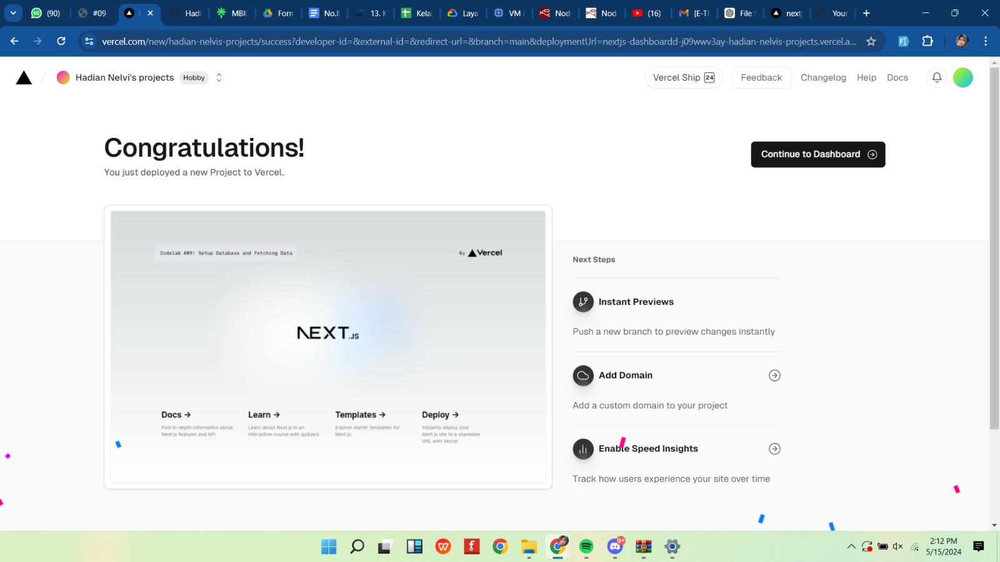
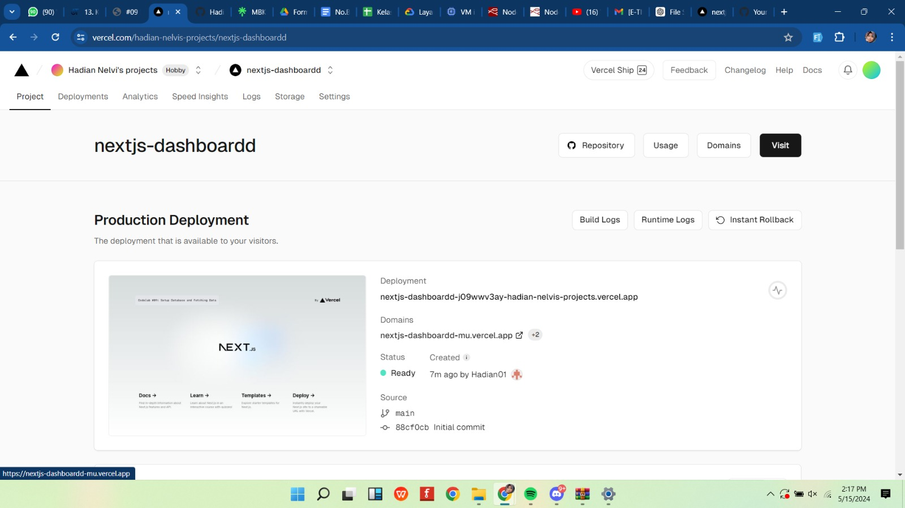
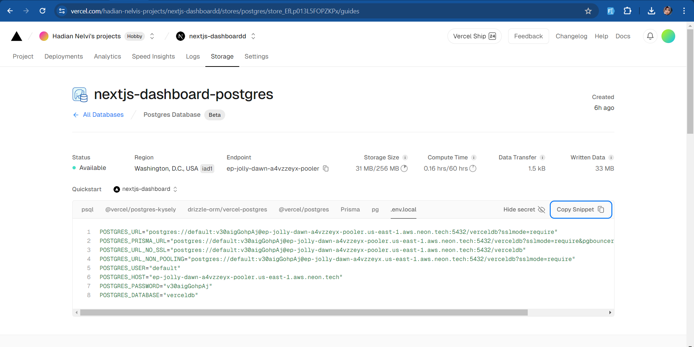
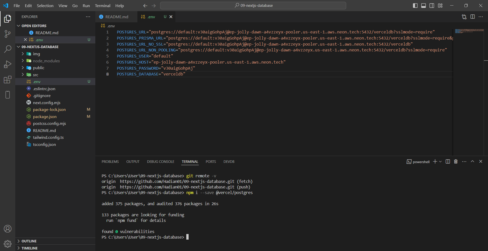
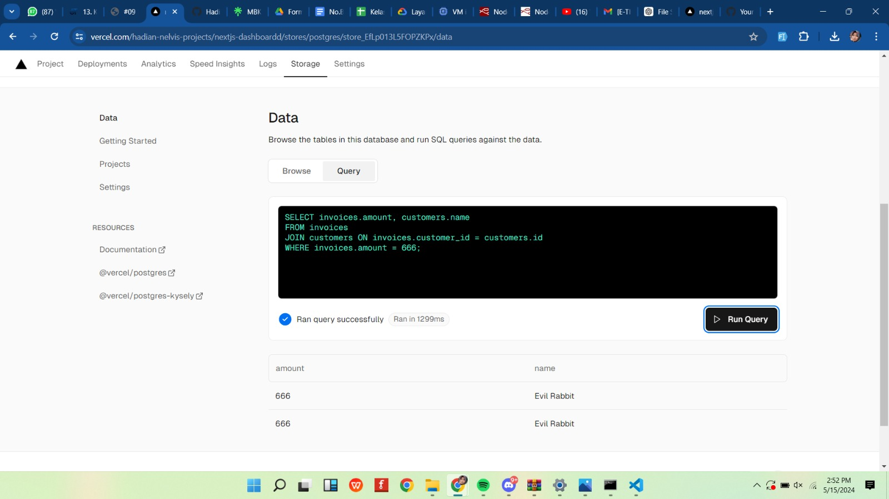
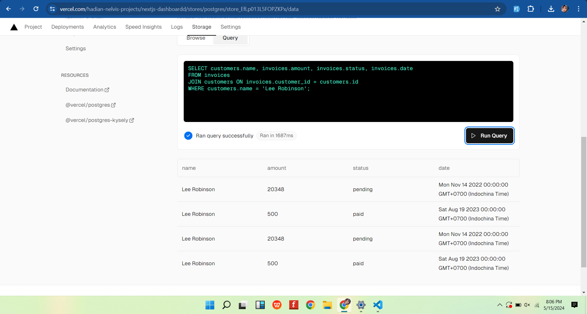
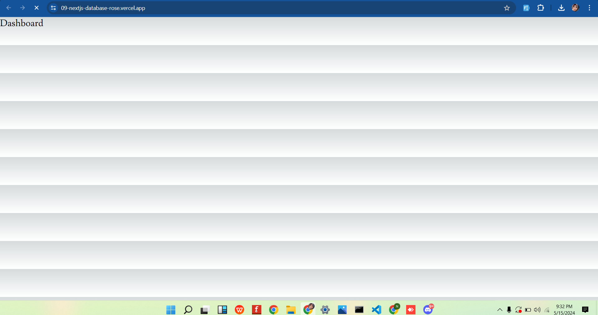

Nama : Hadian Nelvi
Kelas : TI-3C
Praktikum 9

Praktikum 1

soal 1

Mengikuti step yang ada di praktikum saya berhasil mendeploy project 09-nextjs-database

soal 2

Dari step yang sudah saya lakukan saya sudah dapat melakukan pembuatan basisdata Postgress dari sahboar varcel. saya juga berhasil dalam mengkonvigurasi lokal .env serta saya juga mengetahui cara instalasi SDK 

soal 3

melakukan seed ke database dengan menambahkan "seed": "node -r dotnv/config ./src/seeder/seed.js"

Soal 4

Hasil dari Query, nampak berhasil dan berarti seeding telah berhasil dilakukan

query lain yang saya lakukan sama ,namun data yang ditampilkan adalah dari kolom customers.name, invoices.amount, invoices.status, dan invoices.date yang memiliki customers.name Lee Robinson.

Soal 5

jadi di percobaan kali ini saya mencoba mengisi folder atom di dalam componts dan saya mengisi komponen molecules dengan 3 file yang berbeda . setelah semua kode saya inputkan dan semua step telah dilakukan saya perlu ngepush projectnya ke git dan nanti akan otomatis kebaca di varcelnya dan berubah menjadi bentuk diatas

ini merupakan link aplikasi nya: https://09-nextjs-database-rose.vercel.app/
